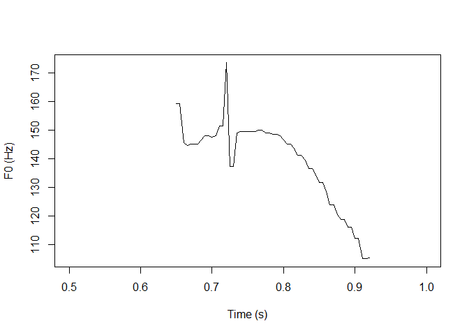
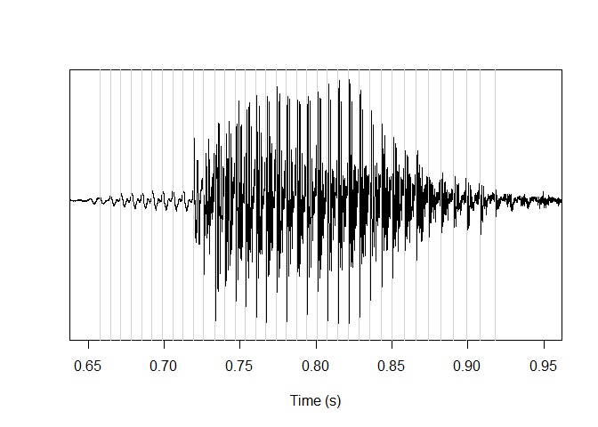

<!-- README.md is generated from README.Rmd. Please edit that file -->

# reapeR

<!-- badges: start -->
<!-- badges: end -->

`reapeR` is a developmental R package providing utilities for
interacting with [David Talkin’s *Ropust Epoch and Pitch EstimatoR*
(REAPER) software](https://github.com/google/REAPER). REAPER provides
precise pitch tracking and epoch estimation from speech data. It is a
command line tool that outputs results in a raw text format. The main
purpose of the `reapeR` library is to clear the potential hurdle of
installing and working with such a command line tool. `reapeR` provides
functionality for installing REAPER locally, for running the software
(in bulk or on a single sound file), for loading in output files
generated by REAPER using well-formatted R data structures, and for
converting REAPER output into files that can be used with
[Praat](https://www.fon.hum.uva.nl/praat/).

This is a beta version of `reapeR`! The functions for interacting with
REAPER are command line interfaces and as such, can be unstable across
machines. An unquestionably better solution to these problems would be
to use `Rcpp` or similar to directly integrate the REAPER source code
into R without the unstable command line overhead, but this is somewhat
above my pay grade (and building a command line interface was
comparatively fast and painless). If you run into any problems with the
package, I’m happy to hear about them.

## Installation

You can install the development version of `reapeR` from
[GitHub](https://github.com/) with:

``` r
# install.packages('devtools')
devtools::install_github('rpuggaardrode/reapeR')
```

This should also install REAPER along with the R package. If this does
not work for some reason, you can try again with the `reaper_install()`
function.

``` r
reapeR::reaper_install()
```

## Running REAPER from R

If REAPER was successfully installed, you can now run the software from
R using the `reaper()` function. In the simplest use case, you just pass
a single argument with the name of a sound file.

``` r
library(reapeR)
reaper_out <- reaper('inst/extdata/1.wav')
```

The resulting object, `reaper_out`, is a `list` containing two elements
called `pitch` and `epochs`.

``` r
class(reaper_out)
#> [1] "list"
names(reaper_out)
#> [1] "pitch"  "epochs"
```

`pitch` is a tibble with columns including information about the time of
each analysis frame, a column with information about whether the frame
is voiced, a column with the predicted *F*<sub>0</sub>, and a column
with the file name.

``` r
head(reaper_out$pitch)
#> # A tibble: 6 × 4
#>    time voiced    f0 file              
#>   <dbl>  <dbl> <dbl> <chr>             
#> 1 0.005      0    NA inst/extdata/1.wav
#> 2 0.01       0    NA inst/extdata/1.wav
#> 3 0.015      0    NA inst/extdata/1.wav
#> 4 0.02       0    NA inst/extdata/1.wav
#> 5 0.025      0    NA inst/extdata/1.wav
#> 6 0.03       0    NA inst/extdata/1.wav
```

The predicted pitch track looks like this (zooming into the middle of
the file where there is voicing):

``` r
plot(reaper_out$pitch$time, reaper_out$pitch$f0, type = 'l',
     xlab = 'Time (s)', ylab = 'F0 (Hz)',
     xlim = c(0.5, 1))
```



`epochs` is just a named vector of values telling you the locations of
glottal closure instants:

``` r
reaper_out$epochs
#> $`inst/extdata/1.wav`
#>  [1] 0.657914 0.664649 0.671497 0.678345 0.685215 0.692041 0.698844 0.705646
#>  [9] 0.712381 0.719501 0.725873 0.733243 0.740045 0.746825 0.753560 0.760249
#> [17] 0.766916 0.773605 0.780317 0.787098 0.793787 0.800590 0.807415 0.814331
#> [25] 0.821293 0.828390 0.835510 0.842834 0.850272 0.857891 0.865646 0.873810
#> [33] 0.882086 0.890567 0.899229 0.908209 0.917687
```

Here they are plotted along with the sound file in question:

``` r
snd <- tuneR::readWave('inst/extdata/1.wav')
times <- seq(0, length(snd@left) / snd@samp.rate, 
             length.out = length(snd@left))
plot(times, snd@left, type = 'l', xlab = 'Time (s)', ylab = '', yaxt = 'n',
     xlim = c(0.65, 0.95))
abline(v = reaper_out$epochs[[1]], col='lightgrey')
```



You can use the same arguments with `reaper()` as when running the
program from the command line (pitch floor and ceiling, analysis
interval, etc). These arguments can be inspected by calling `?reaper`
from the console. If you’re only interested in the `pitch` data frame,
set `output = 'pitch'`. If you just want epochs, set
`output = 'epochs'`. If you can’t get the REAPER installation to work
with the R package but you already have REAPER in your system and want
to control it with R, you can set the path to your REAPER executable
with the `exePath` argument.

If you want to run REAPER on all files in a directory, you can do so
with the `reaper_bulk()` function, where you pass the path to a
directory instead of the path to a sound file:

``` r
reaper_output <- reaper_bulk('inst/extdata')
```

`reaper_bulk()` has a few more interesting options.

There’s the argument `hirst2pass`, which can be set to `TRUE` to use the
Hirst/De Looze two-pass procedure to estimate suitable pitch floor and
ceiling values. In this case, REAPER is run with very liberal floor and
ceiling values on the directory, and the resulting pitch is used to
estimate more suitable values for a second pass.

Additionally, the `praat_output` argument can be set to `TRUE`, in which
case the REAPER estimated pitch is also saved as `.Pitch` files that can
be read in Praat (to a directory specified with `praat_output_dir`).

## Working with REAPER output

If you don’t want to call REAPER from R or can’t get the command line
interface to work, the library also comes with several functions to work
with REAPER output files.

`read_pitch_out()` will read an ASCII-formatted REAPER pitch output file
(saved with `-f filename -a`) as a well-formatted tibble.

``` r
pitchOut <- read_pitch_out('inst/extdata/pitch')
head(pitchOut)
#> # A tibble: 6 × 3
#>    time voiced    f0
#>   <dbl>  <dbl> <dbl>
#> 1 0.005      0    NA
#> 2 0.01       0    NA
#> 3 0.015      0    NA
#> 4 0.02       0    NA
#> 5 0.025      0    NA
#> 6 0.03       0    NA
```

`read_epochs_out()` will read an ASCII-formatted REAPER epochs
(‘pitchmarks’) output file (saved with `-p filename -a`) as a vector.

``` r
epochsOut <- read_epochs_out('inst/extdata/epochs')
epochsOut
#>  [1] 0.651542 0.657914 0.664649 0.671497 0.678345 0.685215 0.692041 0.698844
#>  [9] 0.705646 0.712381 0.719501 0.725873 0.733243 0.740045 0.746825 0.753560
#> [17] 0.760249 0.766916 0.773605 0.780317 0.787098 0.793787 0.800590 0.807415
#> [25] 0.814331 0.821293 0.828390 0.835510 0.842834 0.850272 0.857891 0.865646
#> [33] 0.873810 0.882086 0.890567 0.899229 0.908209 0.917687
```

If you’re interested in working with this output in Praat, the
`write_praat_pitch()` function will save a tibble with pitch output as a
`.Pitch` file, and the `write_praat_epochs()` function will save a
vector with epoch output as a `.PointProcess` file.

If you want to import REAPER-estimated pitch into an [EMU
database](https://rpuggaardrode.github.io/emuintro/), you can convert a
tibble with pitch output to SSFF files using the `reaper2ssff()`
function.
